# PROJECT 3 DOCUMENTATION

## THIS PROJECT AIMS TO TEACH LAYER 7 LOAD BALANCING AND LOAD BALANCING ALGORITHMS USING NGINX AS A LOAD BALANCER ##

### In this project, you'll configure Nginx as a Layer 7 reverse proxy load balancer to distribute HTTP requests evenly across multiple backend servers using the default round-robin algorithm. This setup will demonstrate basic load balancing techniques, scalability by adding servers, and options for advanced load balancing methods, such as least connections and IP hash.

- Deploy three servers

- Set up static websites on two servers using Nginx.

- Use two separate HTML files with distinct content. Deploy one file to each server's index.html location.

- Set up Nginx on the third server. It will act as a load balancer.

- Configure Nginx to load and balance traffic between two static websites.

- Add the Nginx Load balancer IP to the DNS A record.

- Try accessing the website. Every time you reload the website you should see a different index.html.

## **Documentation**

Please refer to Project 1 for instructions on setting up an Ubuntu server, including how to create and link an elastic IP address to your server, along with other related tasks *https://github.com/darejoneson/Devops-Beginer/tree/main/Project1*

- Spin up your 3 ubuntu servers. Ensure you clearly name them so you don't make mistakes.

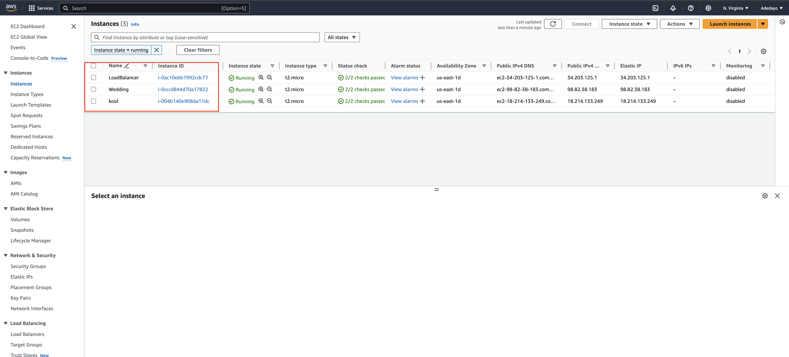

- Download your website template from your preferred website by navigating to the website, locating the template you want.

- Right click and select Inspect from the drop down menu.

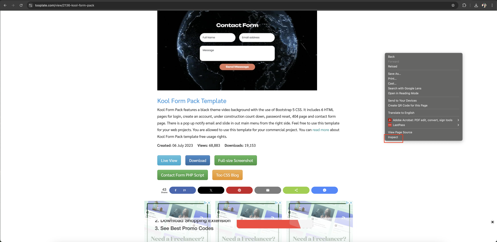

- Click on the Network tab.

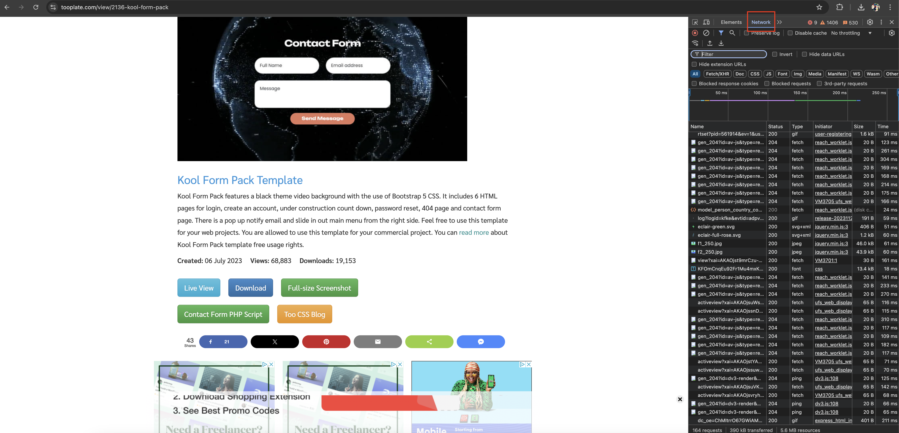

- Click the Download button and right click on the website name

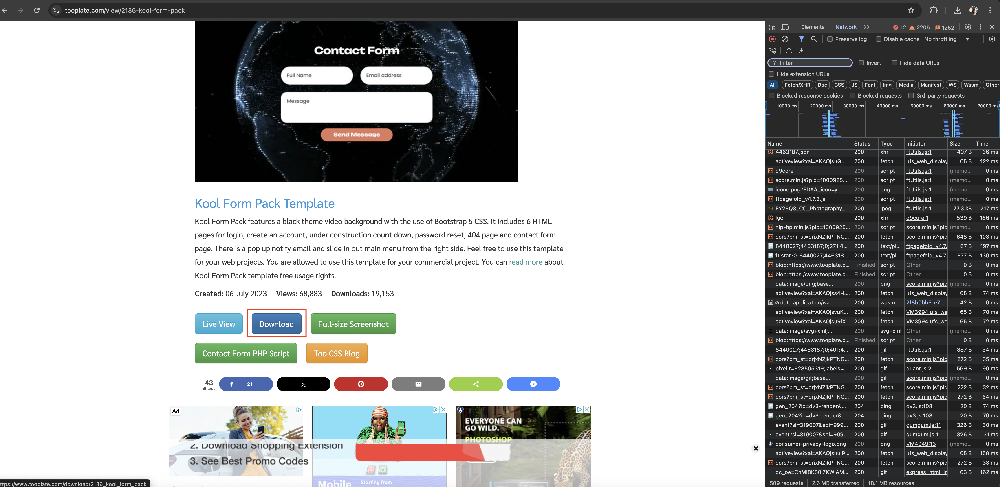

- Select Copy and click on Copy URL.

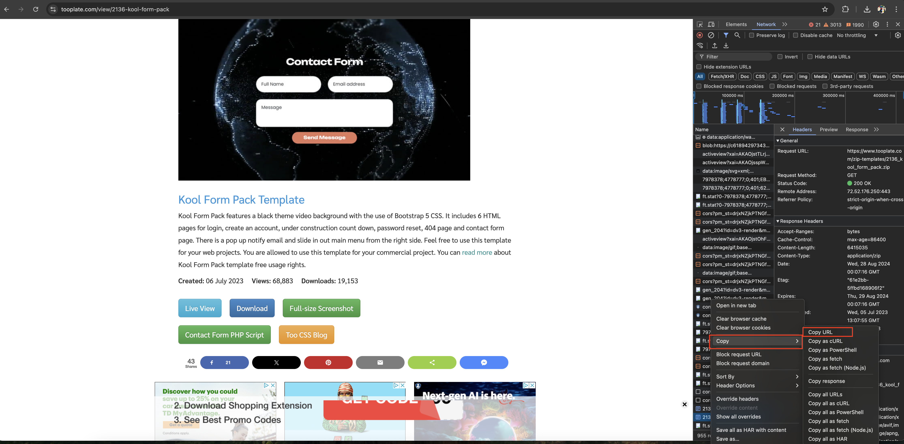

## **Install Nginx and Setup Your Website**

- To install Nginx, execute the following commands on your terminal.

- run **sudo apt update** command

- **sudo apt upgrade**

- **sudo apt install nginx**

- Start your Nginx server by running the ***sudo systemctl start nginx*** command, enable it to start on boot by executing ***sudo systemctl enable nginx***, and then confirm if it's running with the ***sudo systemctl status nginx*** command.

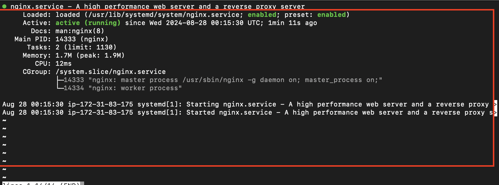

> [!Note]
Install Nginx on each of the web server terminals. These are the terminals you're using to manage the servers that host the two different website contents, which the load balancer will use to distribute incoming traffic.

- Visit your instances IP address in a web browser to view the default Nginx startup page.

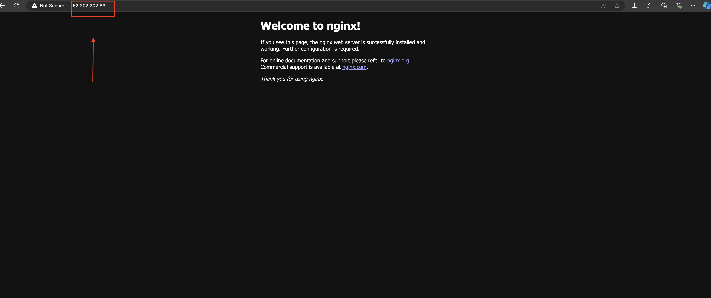

- install the unzip tool and run the following command to download and unzip your website files.

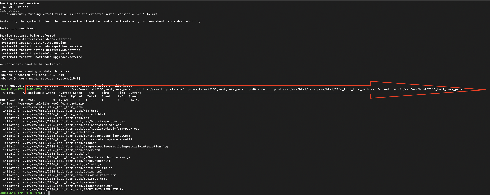

- To set up your website's configuration, start by creating a new file in the Nginx sites-available directory

- Copy and paste the following code into the open text editor.

- Edit the root directive within your server block to point to the directory where your downloaded website content is stored.

- Create a symbolic link for both websites by running the following command. ***sudo ln -s /etc/nginx/sites-available/wedding /etc/nginx/sites-enabled/***

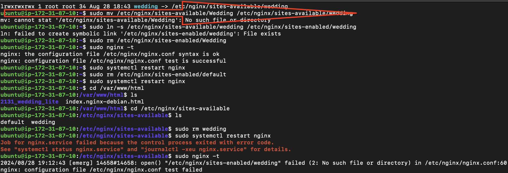
- Run the ***sudo nginx -t*** command to check the syntax of the Nginx configuration file, and when successful run the ***sudo systemctl restart nginx*** command.

-  this was also repeated for the second website.

> [!Note]
Open a new terminal window and connect to the second server. Update the website content with something different there. Reload your website to see how the load balancer distributes traffic—it might send you to the updated version on the second server, making the differences between the two versions stand out.

- Execute ***sudo apt install unzip*** to install the unzip tool and run the following command to download and unzip your website files ***sudo curl -o /var/www/html/2136_kool_form_pack.zip https://www.tooplate.com/zip-templates/2136_kool_form_pack.zip && sudo unzip -d /var/www/html/ /var/www/html/2136_kool_form_pack.zip && sudo rm -f /var/www/html/2136_kool_form_pack.zip***

- To set up your website's configuration, start by creating a new file in the Nginx sites-available directory. Use the following command to open a blank file in a text editor: ***sudo nano /etc/nginx/sites-available/wedding***.

> [!Note]
I went ahead and ran ***sudo rm /etc/nginx/sites-enabled/default*** on both the first and second servers. By deleting these default site-enabled folders, I've ensured that Nginx will now serve content from my specified website directories. Without removing these default folders, the default Nginx page would still be displayed, which is not what I want. Now, my customized content will be served correctly by Nginx.

- Run the ***sudo systemctl restart nginx*** command to restart your server.

- Check both IP addresses to confirm your website is up and running.

## **Configure your Load balancer**

- Install Nginx on the server you want to use as a load balancer, and execute ***sudo systemctl status nginx*** to ensure it's running.

- Execute ***sudo nano /etc/nginx/nginx.conf*** to edit your Nginx configuration file.

- Add the following within the http block.

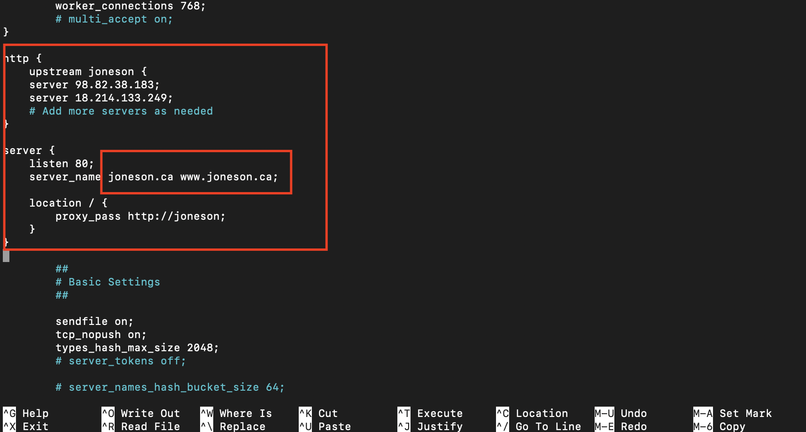

> [!Note]
As shown in the picture. I substituted <server 1> and <server 2> with the actual private IP addresses of my servers. I also replaced <your domain> and www.<your domain> with my actual root domain and subdomain names. Additionally, I updated the proxy_pass and other relevant fields accordingly to ensure everything points correctly to my setup.

- Run ***sudo nginx -t*** to check for syntax error.

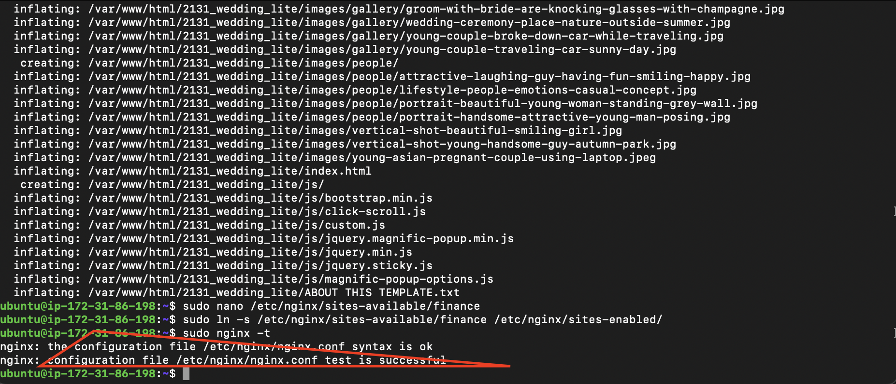

- Apply the changes by restarting Nginx: ***sudo systemctl restart nginx***

## **Create An A Record**

I completed the step to make my website accessible via my domain name instead of just the IP address. I moved the hosting to AWS Route 53. Then, I set up an A record in Route 53 to point my domain to the correct IP address. Now, my website can be accessed using my domain name.

> [!Note]
The project1 highlight the instructions on how to create a hosted zone. 

- Point your domain's DNS records to the IP addresses of your Nginx load balancer server.

- In route 53, select the domain name and click on **Create record**.

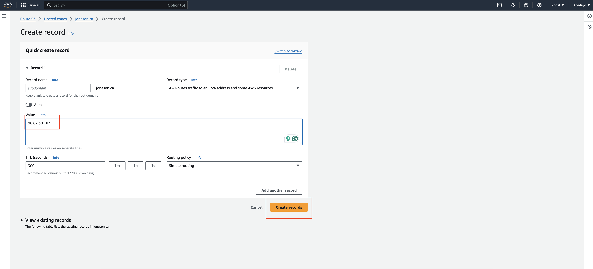

- Paste your **IP address➀** and then click on **Create records➁** to create the root domain.

- Click on create record again, to create the record for your sub domain.

- Paste your IP address➀, input the Record name(www➁) and then click on **Create records➂**

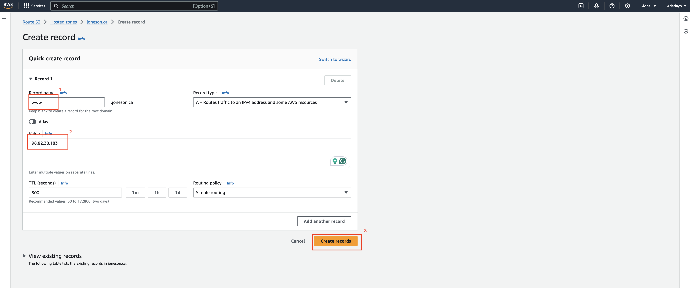

- Go to the terminal you used in setting your first website and run ***sudo nano /etc/nginx/sites-available/wedding*** to edit your settings. Enter the name of your domain and then save your settings

- Go to your domain name in a web browser to verify that your website is accessible.

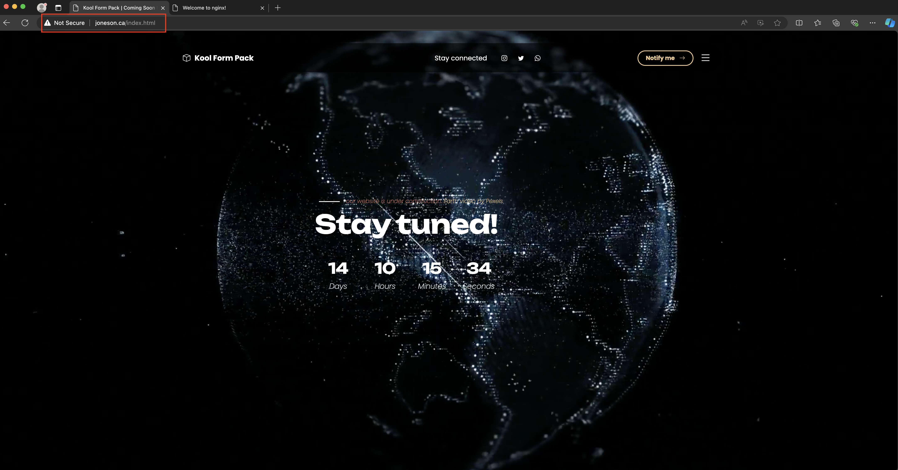

- Reload the webpage to ensure the load balancer distributes traffic evenly between your servers.

## **Install certbot and Request For an SSL/TLS Certificate**

- Install certbot by executing the following commands: ***sudo apt update sudo apt install python3-certbot-nginx***

- Execute the ***sudo certbot --nginx*** command to request your certificate. Follow the instructions provided by certbot and select the domain name for which you would like to activate HTTPS.

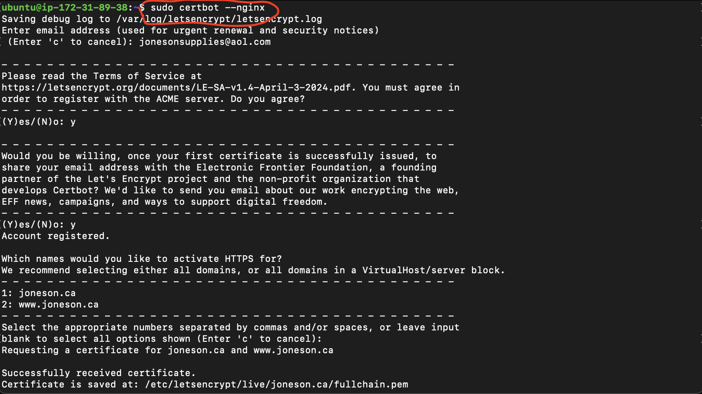

- You should get a congratulatory message that says https has been successfully enabled.

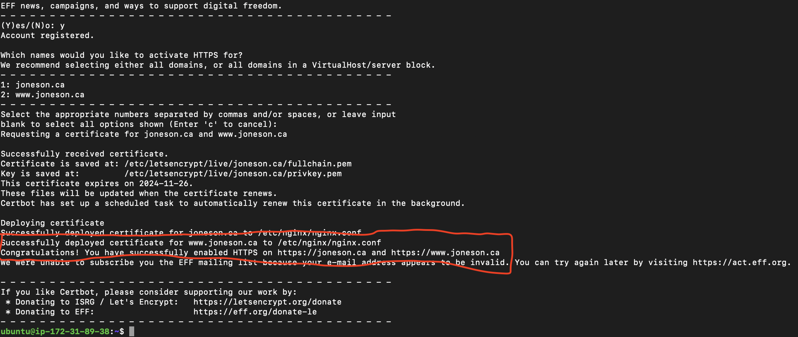

- Access your website to verify that Certbot has successfully enabled HTTPS.

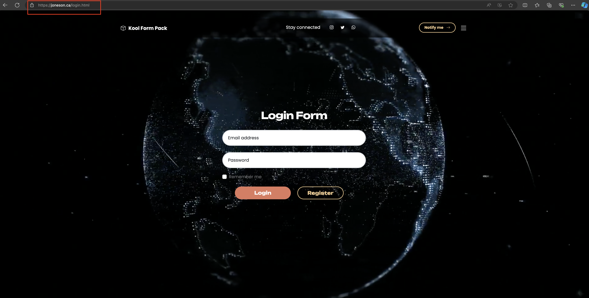

### **The End Of Project 3**