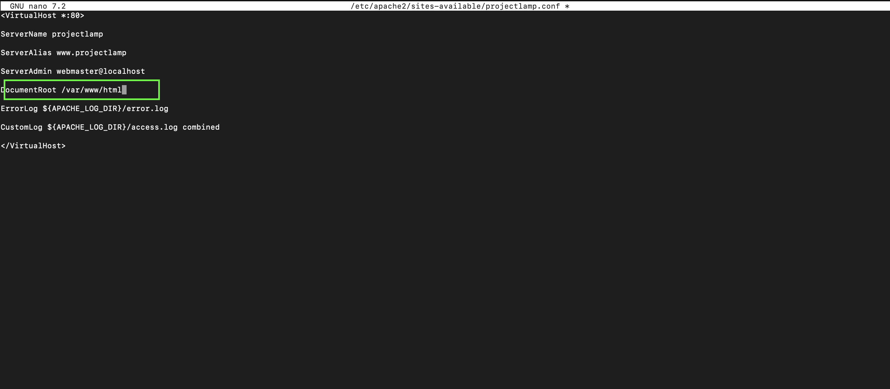
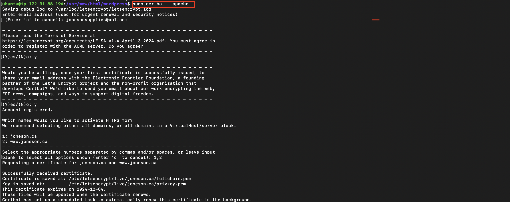

# **PROJECT 4 DOCUMENTATION**

## Set up a WordPress website using the LAMP stack (Linux, Apache, MySQL, PHP). This guide walks you through setting up the server environment, installing WordPress, and optimizing performance. Suitable for both beginners and experienced developers, it provides the steps to deploy a secure, efficient, and customizable WordPress site using the LAMP stack. ##

### Project Tasks and Checklist ###

- Deploy an Ubuntu Server

- Set up your LAMP stack on the server

- Configure the wordpress Application

- Map the IP address to the DNS A record

- Validate the WordPress website setup by accessing the web address

## Documentation ##

Kindly visit **PROJECT1** for guidance on spinning up an Ubuntu server.

- Set an inbound rule for MYSQL in your security group. Click on Security① and select the Security group②

- Click on Edit inbound rules.

- Click on Add rule

- Click on Custom TCP① and select MySQL/Aurora②.

- Enter the IP address① you want to allow access and click Save rules②.

> [!Note]
For better security, I recommend restricting access to MySQL to just your Web Server’s IP address, rather than allowing access from anywhere (0.0.0.0/0). In the Inbound Rule configuration, set the source to your Web Server’s IP address followed by /32 to ensure only that specific IP can access the database. This will significantly enhance your setup's security.

## **Install Apache**

- To install Apache, run the following commands in your terminal

**sudo apt update**

**sudo apt install apache2**

- To enable Apache to start on boot, execute **sudo systemctl enable apache2**①, and then verify its status with the **sudo systemctl status apache2**② command

- Now, let's check if our server is running and accessible both locally and from the Internet by executing the following command: **curl http://localhost:80**

 *Now that you've secured MySQL access, let's move on to testing the Apache HTTP server. To check how it responds to requests from the Internet, simply open a web browser and enter your server's public IP address. If Apache is configured correctly, you should see the default Apache welcome page. This will confirm that your server is accepting and responding to HTTP requests.*

 - Copy your public IPv4 address from your EC2 dashboard.

- If the installation was successful, you should see this page.

## **Install MYSQL** ##

- To install this software using 'apt', run the command **sudo apt install mysql-server**. When prompted, confirm the installation by typing 'Y' and then pressing ENTER.

- After the installation is complete, log in to the MySQL console by typing: sudo mysql

> [!Note]
I recommend running the MySQL security script to enhance security. Before running the script, you'll need to set a password for the root user using the mysql_native_password authentication method. For this project, we'll set the password as "pass," but feel free to choose a more secure password if you'd like. Here’s how to do it:

- Run the following command to set the password for the root user with the MySQL native password authentication method: **ALTER USER 'root'@'localhost' IDENTIFIED WITH mysql_native_password BY 'pass';**. Exit the MySQL shell when you're done by typing exit

> [!Note]
Since you plan to terminate the resources after the project, it's fine to set the password validation policy level to 0 for minimal security. However, when working on production systems or on the job, it's highly recommended to use the strongest password validation policy level, which is 2. This ensures stronger password requirements, enhancing security by enforcing complexity, length, and character diversity in passwords. Always prioritize security in live environments.

- Enable MySQL to start on boot by executing **sudo systemctl enable mysql**①, and then confirm its status with the **sudo systemctl status mysql**② command.

## **Install PHP** ##

- Install PHP along with required extensions by running the following script: **sudo apt install php-curl php-gd php-mbstring php-xml php-xmlrpc php-soap php-intl php-zip**.

**sudo apt install php libapache2-mod-php php-mysql**

- Confirm the downloaded PHP version by running **php -v**.

## **Creating A Virtual Host For Your Website Using Apache** ##

- Create the directory for Projectlamp using the 'mkdir' command as follows: sudo mkdir /var/www/projectlamp① and assign ownership of the directory to our current system user using: sudo chown -R $USER:$USER /var/www/projectlamp②

- Create and open a new configuration file in Apache's sites-available directory using your preferred command-line editor: **sudo vi /etc/apache2/sites-available/projectlamp.conf**.

- Creating this will produce a new blank file. Paste the configuration text provided below into it.

- Save your changes by pressing the Esc key, then type :wq and press Enter

- Run the ls command **sudo ls /etc/apache2/sites-available**① to show the new file② in the sites-available directory.

- We can now enable the new virtual host using the a2ensite command: **sudo a2ensite projectlamp**.

- To disable Apache's default website, use the a2dissite command. Type: **sudo a2dissite 000-default**.

- To ensure your configuration file doesn’t contain syntax errors, run: sudo apache2ctl configtest. You should see "Syntax OK" in the output if your configuration is correct.

- Finally run: **sudo systemctl reload apache2**. This will reload Apache for the changes to take effect.

> [!Note]
Our new website is now active, but the web root /var/www/projectlamp is still empty. Let's create an index.html file in that location to test that the virtual host works as expected.

- To create the index.html file with the content "Hello LAMP from Jay" in the /var/www/projectlamp directory, use the following command: **sudo echo 'Hello LAMP from Jay' > /var/www/projectlamp/index.html**.

- Now, let's open our web browser and try to access our website using the IP address:

http://<**EC2-Public-IP-Address**>:80

> [!Note]
My **http://54.89.217.149:80** was replaced here.

- Remove the index.html file by running the following command: sudo rm /var/www/projectlamp/index.html 

## **Enable PHP On The Website** ##

With the default DirectoryIndex settings on Apache, a file named index.html will always take precedence over an index.php file. To change the precedence of index files (such as index.php over index.html) in Apache, you'll need to edit the dir.conf file. Here’s how you can do it:

- Edit the dir.conf file using a text editor (such as nano or vi): **sudo nano /etc/apache2/mods-enabled/dir.conf**

- Look for the DirectoryIndex directive within this file. It typically looks like this:

- To prioritize index.php over index.html, move index.php to the beginning of the list, like this:

Press **ctrl** + **x**① on your keyboard to save and exit.

- Finally, reload Apache for the changes to take effect: **sudo systemctl reload apache2**

Now, Apache will prioritize index.php over index.html when both files exist in the same directory.

- To create a new file named index.php inside your custom web root folder (/var/www/projectlamp), you can use the following command to open it in the **nano text editor: nano /var/www/projectlamp/index.php** .

- This will create a new file. Copy and paste the following PHP code into the new file:

- Once you've saved and closed the file, go back to your web browser and refresh the page. You should see something like this:

> [!Note]
This page gives you valuable insights into your server from PHP's perspective, making it a great tool for debugging and ensuring that your settings are correctly applied.

If you can see this page in your browser, congratulations 🎉—your PHP installation is working as expected! After reviewing the relevant information about your PHP server, I recommend deleting the file you created, as it exposes sensitive information about your PHP environment and Ubuntu server. To delete the file, run this command: **sudo rm /var/www/projectlamp/index.php**  

If needed, you can always recreate the file later to access this information again.

## **Install Wordpress** ##

After setting up our LAMP environment, we can start installing WordPress. First, we'll download the WordPress installation files and place them in the default web server root directory: /var/www/html.

Navigate to the directory using the **cd command cd /var/www/html**, and then download the WordPress installation files using the following command: **sudo wget -c http://wordpress.org/latest.tar.gz**

- Extract the files from the downloaded WordPress archive using the command: **sudo tar -xzvf latest.tar.gz**

- Run the command **ls -l** to confirm the existence of the wordpress directory in the current location (/var/www/html).

> [!Note]
To ensure the web server can properly manage and serve files, it’s essential that the files are owned by the user under which the web server is running. On most Ubuntu and Debian systems, the default user for web server processes, such as Apache or Nginx, is www-data. This user is responsible for handling the server's operations and managing incoming web requests.

Before assigning ownership, it's a good practice to verify which user is currently running the web server, especially if your system has multiple services that may not use the default user. Once confirmed, you can assign ownership of the necessary files to this user, ensuring the web server has appropriate access.

After assigning ownership to the correct user (such as www-data), it's also important to adjust the file permissions. Typically, permissions should allow the web server to read and execute the files, but not write to them unless explicitly required. Proper ownership and permissions ensure the server can function smoothly while maintaining a secure environment.

- Check the user running your web server with the command: **ps aux | grep apache | grep -v grep**.

- Grant ownership of the WordPress directory and its files to the web server user (www-data) by running the command: **sudo chown -R www-data:www-data /var/www/html/wordpress**.

### **Create a Database For Wordpress** ###

- Access your MySQL root account with the following command: **sudo mysql -u root -p**①. Enter the password② you set earlier when prompted.

- To create a separate database named wp_db for WordPress to manage, execute the following command in the MySQL prompt: **CREATE DATABASE wp_db;**

> [!Note]
This command allows you to create a new database (wp_db) within your MySQL environment. Feel free to name it as you prefer.

- To access the new database, you can create a MySQL user account with a strong password using the following command: **CREATE USER jay@localhost IDENTIFIED BY 'wp-password';**

Replace 'wp-password' with your preferred strong password for the MySQL user account.

- To grant your created user (dre@localhost) all privileges needed to work with the wp_db database in MySQL, use the following commands:

> [!Note]
This grants all privileges (ALL PRIVILEGES) on all tables within the wp_db database (wp_db.*) to the user jay when accessing from localhost. The FLUSH PRIVILEGES command ensures that MySQL implements the changes immediately. Adjust the database name (wp_db) and username (dre) as per your setup.

## **Configure Wordpress** ##

Once you've established a database for WordPress, the next crucial step is setting up and configuring WordPress itself. To begin, you'll need to create a configuration file tailored for WordPress.

- Rename the sample WordPress configuration file with the command: **mv wp-config-sample.php wp-config.php**.

- Edit the **wp-config.php** file using the command: **sudo nano wp-config.php.**

- Update the database settings in the **wp-config.php** file by replacing placeholders like database_name_here, username_here, and password_here with your actual database details.

- Modify the configuration file projectlamp.conf: **sudo nano /etc/apache2/sites-available/projectlamp.conf** to update the document root to the directory where your WordPress installation is located.

- After updating the document root to **/var/www/html** directory in your editor, save the changes and exit.

- Reload Apache for the changes to take effect: **sudo systemctl reload apache2**

- Once you've completed these steps, you can access your WordPress page to complete the installation. Open your web browser and go to **http://<EC2 IP>/wordpress/**. This will lead you to the WordPress setup wizard where you can finalize the installation process.

> [!Note]
Replace with the IP address of your EC2 instance when accessing your WordPress page.

- Select your preferred language and then click on Continue to proceed.

- Enter the required information and click on Install WordPress once you have finished.

**Site Title**①: Enter the name of your WordPress website. It's recommended to use your domain name for better optimization.

**Username**②: Choose a username for logging into WordPress.

**Password**③: Set a secure password to protect your WordPress account.

**Your email**④: Provide your email address to receive updates and notifications.

**Search engine visibility**⑤: You can leave this box unchecked to prevent search engines from indexing your site until it's ready.

- WordPress has been successfully installed. You can now log in to your admin dashboard using the previously set up information by clicking the **Log** In button.

- Enter your username and password, then click **Log** In to access your WordPress admin dashboard

- Once you successfully log in, you will be greeted by the WordPress dashboard page.

## **Create An A Record** ##

To make your website accessible via your domain name rather than the IP address, you'll need to set up a DNS record. I did this by buying my domain from Namecheap and then moving hosting to AWS Route 53, where I set up an A record.

> [!Note]
Visit Project1 for instructions on how to create a hosted zone.

- Point your domain's DNS records to the IP addresses of your Apache load balancer server.

- In route 53, click on Create record.

- Paste your IP address➀ and then click on Create records➁ to create the root domain.

- Click on Create record again, to create the record for your sub domain.

Paste your IP address➀, input the Record name(www➁) and then click on Create records➂.

- To update your Apache configuration file in the sites-available directory to point to your domain name, use the command: **sudo nano /etc/apache2/sites-available/projectlamp.conf**

> [!Note]
This command opens the **projectlamp.conf** file in the nano text editor with superuser privileges (sudo). Within the editor, adjust the necessary details to reflect your domain name configuration.

- Ensure that the server settings in your Apache configuration point to your domain name, and that the document root accurately points to your WordPress directory. Once you've made these adjustments, save the changes and exit the editor.

> [!Note]
The new configuration defines how Apache should handle requests for your domain, and its subdomain. With this configuration: Apache will handle requests for cloudghoul.online and www.joneson.ca Files will be served from the **/var/www/html/wordpress** directory. Directory listings and symbolic links are allowed. The directory can be accessed by any client. Error logs will be written to **/var/log/apache2/error.log**. Access logs will be written to **/var/log/apache2/access.log** in the combined log format.

- To update your **wp-config.php** file with DNS settings, use the following command: sudo nano **wp-config.php** and add these lines to the file:

- Reload your Apache server to apply the changes with the command: **sudo systemctl reload apache2**, After reloading, 1 visit my website at http://joneson.ca to view your WordPress site. Replace with your actual domain name.

- To log in to my WordPress admin portal, i visit http://joneson.ca/wp-admin, And I entered my username① and password②, then click on log In③.

> [!Note]
My domain name is joneson.ca, so i visit http://joneson.ca/wp-admin.

- Now that your WordPress site is successfully configured to use your domain name, the next step is to secure it by requesting an SSL/TLS certificate.

## **Install certbot and Request For an SSL/TLS Certificate** ##

- Install certbot by executing the following commands: **sudo apt update sudo apt install certbot python3-certbot-apache**

- Run the command: **sudo certbot --apache** to request your SSL/TLS certificate. Follow the instructions provided by Certbot to select the domain name for which you want to enable HTTPS.

- You should receive a message confirming that the certificate has been successfully obtained.

- Visit your website to confirm, and you'll notice that the "not secure" warning no longer appears, indicating that your site is now secure with HTTPS.

## **The End Of Project 4** ##

