# CREATING VPC SUBNETS ROUTE TABLES AND OTHER SERVICES USING TERRAFORM

* Terraform is a major tool for Infrastructure as Code (IaC). Which allows you to define your infrastructure using code, making it repeatable, consistent, and scalable.

# DOCUMENTATION

* AWS account with full access to EC2 and VPC service.

* Setting up terraform on an ec2 instance, ensuring there is a valid IAM role attached to the instance with VPC provisioning permissions.

* Ssh into the instance and install terraform

* Terraform AWS VPC creation workflow

* Initialize Terraform and execute

* Create VPC with Terraform Apply

* Validate VPC

## AWS account with full access to EC2 and VPC service

* Logged into my root user account to give full access to the IAM user account and created the IAM ROLES for FULLACCESS EC2 and FULLACCESS VPC


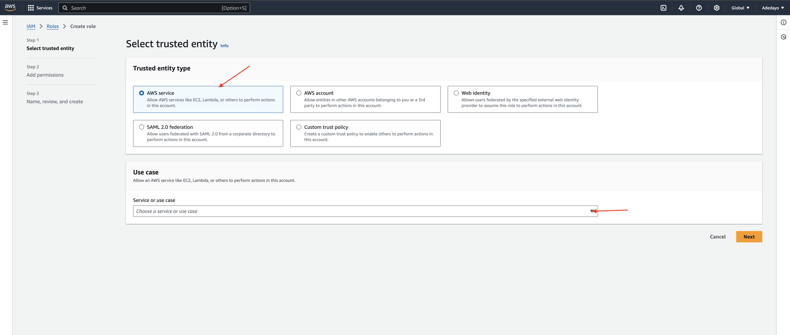

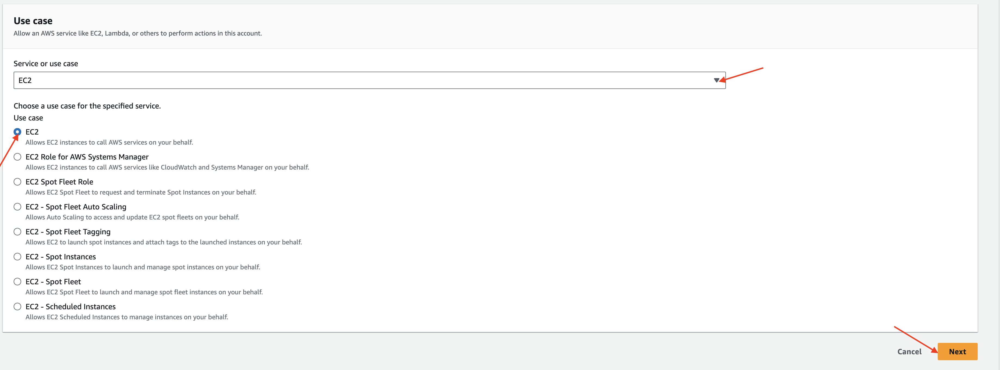

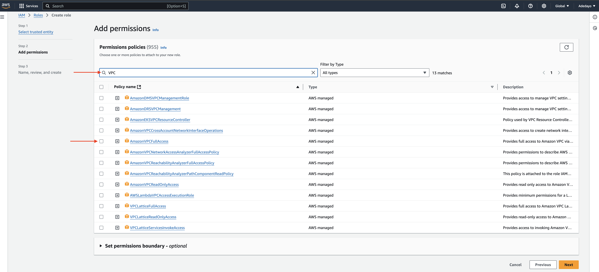

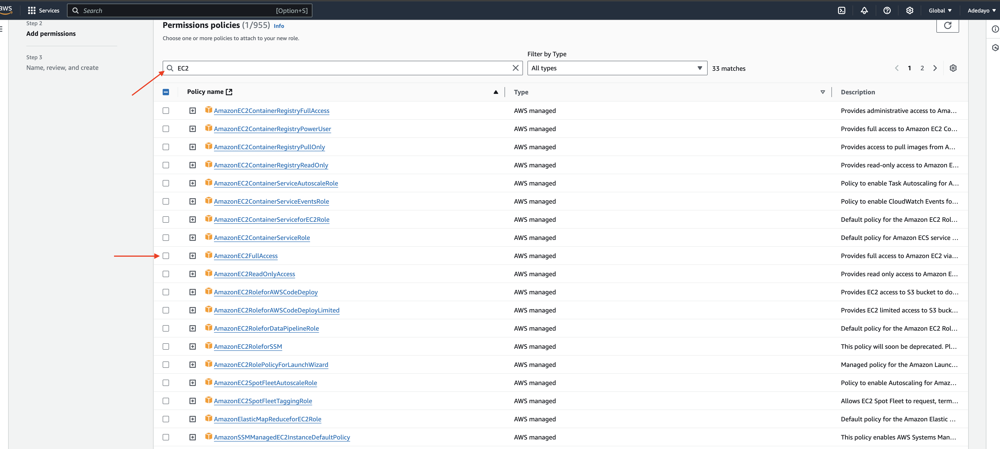

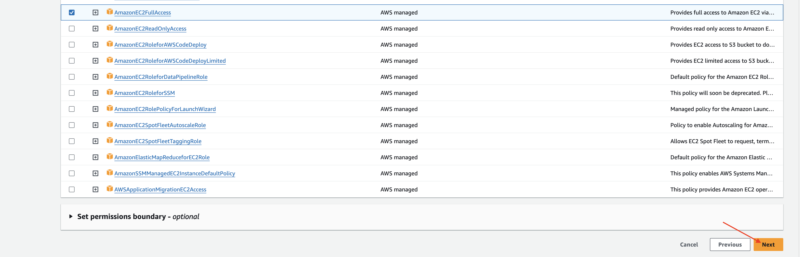

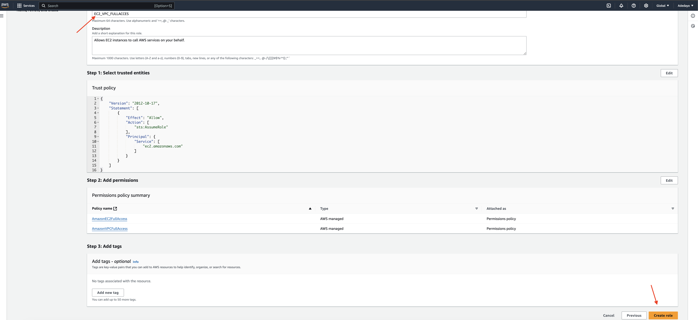

# Setting up terraform on an ec2 instance, ensuring there is a valid IAM role attached to the instance with VPC provisioning permissions

* Logged into my IAM USER account, Picked my region.

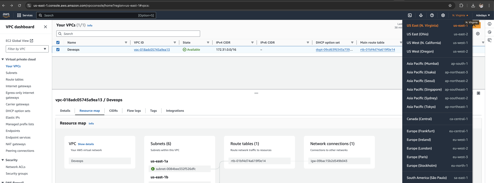

* launched an EC2 instance and attached it to the IAM role with AMAZON FULLACCESS EC2/VPC.

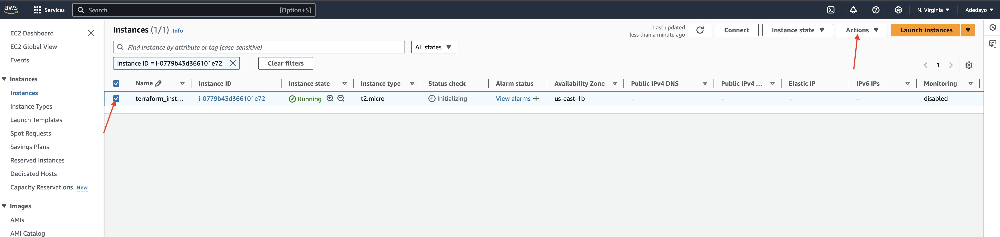

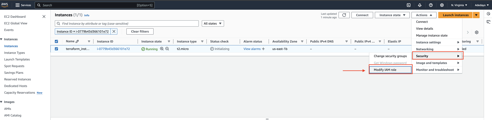


## Ssh into the instance and installed terraform

* Installed terraform by going to the hashicorp website : https://developer.hashicorp.com/terraform on my browser

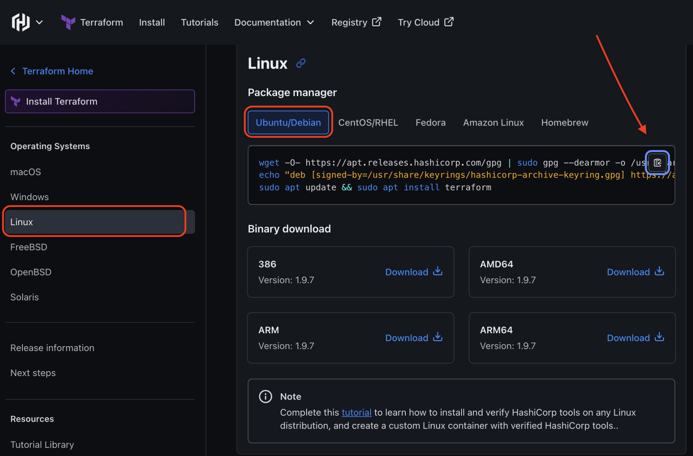

* Clicked on install, picked LINUX Ubuntu/Debian OS for terraform installation and copied the installation package below:

``` 


wget -O- https://apt.releases.hashicorp.com/gpg | sudo gpg --dearmor -o /usr/share/keyrings/hashicorp-archive-keyring.gpg
echo "deb [signed-by=/usr/share/keyrings/hashicorp-archive-keyring.gpg] https://apt.releases.hashicorp.com $(lsb_release -cs) main" | sudo tee /etc/apt/sources.list.d/hashicorp.list
sudo apt update && sudo apt install terraform

``` 

## Terraform AWS VPC creation workflow

* Created VPC with the following;

1. CIDR Block: 10.0.0.0/16
2. Region: us-east-2
3. Availability Zones: us-east-2a, us-east-2b,
12. us-east-2c
4. Subnets: 15 Subnets (One per availability Zone)
5. Public Sunets (3)
6. App Subets (3)
7. DB Subnets (3)
8. Management Subnet (3)
9. Platform Subnet (3)
10. NAT Gateway for Private subnets
11. Internet Gateway for public subnets.

* Cloned an existing repo with the structure of a directory tree for a Terraform project focused on creating and managing AWS infrastructure, specifically a Virtual Private Cloud (VPC)

``` 
git clone https://github.com/TobiOlajumoke/Terraform-VPC.git
```

* cd into the Terraform-VPC folder

```
cd Terraform-VPC
```

* This is a graphical understanding of what the VPC terraform structured directory tree looks like;

```

├── infra
│   └── vpc
│       ├── main.tf
│       └── variables.tf
├── modules
│   └── vpc
│       ├── endpoint.tf
│       ├── internet-gateway.tf
│       ├── nacl.tf
│       ├── nat-gateway.tf
│       ├── outputs.tf
│       ├── route-tables.tf
│       ├── subnet.tf
│       ├── variables.tf
│       └── vpc.tf
└── vars
    └── dev
        └── vpc.tfvars
```

* Let's give more insight on the above tree;

## Directory Breakdown

### infra Directory

* This is typically where the main Terraform configurations reside.

**Vpc Directory**: This subdirectory contains the Terraform files specifically for managing the VPC

* main.tf: This is the primary Terraform configuration file that orchestrates the creation of all resources defined in the module (e.g., VPC, subnets, gateways).
* variables.tf: This file declares the input variables used in the main.tf file, allowing for configurable parameters.

### modules Directory

* Modules are reusable components in Terraform that encapsulate specific functionality. This allows you to organize your code better and promote reuse.

**vpc Directory**: This module is specifically for managing VPC-related resources.

* endpoint.tf: This file likely defines VPC endpoints for connecting to AWS services privately.
* internet-gateway.tf: This file configures the Internet Gateway, which allows communication between instances in the VPC and the internet.
* nacl.tf: This file defines Network Access Control Lists (NACLs) for managing inbound and outbound traffic to subnets.
* nat-gateway.tf: This file sets up the NAT Gateway, which enables instances in a private subnet to access the internet while preventing inbound traffic.
* outputs.tf: This file specifies the output values (e.g., VPC ID, subnet IDs) that can be used by other Terraform configurations or modules.
* route-tables.tf: This file defines the route tables for directing traffic within the VPC.
* subnet.tf: This file creates the various subnets (public, private) within the VPC.
* variables.tf: This file declares variables specific to the VPC module, which can be passed in from other files.

### vars Directory

* This directory usually contains variable files used for different environments (e.g., development, production).

**dev Directory**: This subdirectory holds variables specific to the development environment.

* vpc.tfvars: This file contains the values for the variables declared in variables.tf. It’s where we'll customize parameters like CIDR blocks, region, availability zones, etc., for the development setup.

* cd into the vars/dev/vpc/tfvars

```
cd vars/dev/vpc/tfvars
```

* Used Nano as my text editor and changed the #tag owner to my name "Joneson"

* made sure my instance region algined "us-east-2"

```
#vpc
region               = "us-east-2"
vpc_cidr_block       = "10.0.0.0/16"
instance_tenancy     = "default"
enable_dns_support   = true
enable_dns_hostnames = true

#elastic ip
domain = "vpc"

#nat-gateway
create_nat_gateway = true

#route-table
destination_cidr_block = "0.0.0.0/0"

#tags
owner       = "tjagz"
environment = "dev"
cost_center = "DevOps-commerce"
application = "OpsApp"

#subnet

map_public_ip_on_launch       = true

public_subnet_cidr_blocks     = ["10.0.1.0/24", "10.0.2.0/24", "10.0.3.0/24"]
app_subnet_cidr_blocks        = ["10.0.4.0/24", "10.0.5.0/24", "10.0.6.0/24"]
db_subnet_cidr_blocks         = ["10.0.7.0/24", "10.0.8.0/24", "10.0.9.0/24"]
management_subnet_cidr_blocks = ["10.0.10.0/24", "10.0.11.0/24", "10.0.12.0/24"]
platform_subnet_cidr_blocks   = ["10.0.13.0/24", "10.0.14.0/24", "10.0.15.0/24"]
availability_zones            = ["us-east-2a", "us-east-2b", "us-east-2c"]

#public nacl

ingress_public_nacl_rule_no    = [100]
ingress_public_nacl_action     = ["allow"]
ingress_public_nacl_from_port  = [0]
ingress_public_nacl_to_port    = [0]
ingress_public_nacl_protocol   = ["-1"]
ingress_public_nacl_cidr_block = ["0.0.0.0/0"]

egress_public_nacl_rule_no    = [200]
egress_public_nacl_action     = ["allow"]
egress_public_nacl_from_port  = [0]
egress_public_nacl_to_port    = [0]
egress_public_nacl_protocol   = ["-1"]
egress_public_nacl_cidr_block = ["0.0.0.0/0"]

#app nacl

ingress_app_nacl_rule_no    = [100]
ingress_app_nacl_action     = ["allow"]
ingress_app_nacl_from_port  = [0]
ingress_app_nacl_to_port    = [0]
ingress_app_nacl_protocol   = ["-1"]
ingress_app_nacl_cidr_block = ["0.0.0.0/0"]

egress_app_nacl_rule_no    = [200]
egress_app_nacl_action     = ["allow"]
egress_app_nacl_from_port  = [0]
egress_app_nacl_to_port    = [0]
egress_app_nacl_protocol   = ["-1"]
egress_app_nacl_cidr_block = ["0.0.0.0/0"]

##db nacl

ingress_db_nacl_rule_no    = [100]
ingress_db_nacl_action     = ["allow"]
ingress_db_nacl_from_port  = [0]
ingress_db_nacl_to_port    = [0]
ingress_db_nacl_protocol   = ["-1"]
ingress_db_nacl_cidr_block = ["0.0.0.0/0"]

egress_db_nacl_rule_no    = [200]
egress_db_nacl_action     = ["allow"]
egress_db_nacl_from_port  = [0]
egress_db_nacl_to_port    = [0]
egress_db_nacl_protocol   = ["-1"]
egress_db_nacl_cidr_block = ["0.0.0.0/0"]

##management nacl

ingress_management_nacl_rule_no    = [100]
ingress_management_nacl_action     = ["allow"]
ingress_management_nacl_from_port  = [0]
ingress_management_nacl_to_port    = [0]
ingress_management_nacl_protocol   = ["-1"]
ingress_management_nacl_cidr_block = ["0.0.0.0/0"]

egress_management_nacl_rule_no    = [200]
egress_management_nacl_action     = ["allow"]
egress_management_nacl_from_port  = [0]
egress_management_nacl_to_port    = [0]
egress_management_nacl_protocol   = ["-1"]
egress_management_nacl_cidr_block = ["0.0.0.0/0"]

#platform nacl

ingress_platform_nacl_rule_no    = [100]
ingress_platform_nacl_action     = ["allow"]
ingress_platform_nacl_from_port  = [0]
ingress_platform_nacl_to_port    = [0]
ingress_platform_nacl_protocol   = ["-1"]
ingress_platform_nacl_cidr_block = ["0.0.0.0/0"]

egress_platform_nacl_rule_no    = [200]
egress_platform_nacl_action     = ["allow"]
egress_platform_nacl_from_port  = [0]
egress_platform_nacl_to_port    = [0]
egress_platform_nacl_protocol   = ["-1"]
egress_platform_nacl_cidr_block = ["0.0.0.0/0"]

#endpoint

create_s3_endpoint              = true
create_secrets_manager_endpoint = true
create_cloudwatch_logs_endpoint = true
```
## Initialize Terraform and execute

* cd into the infra/vpc folder and executed the terraform plan to validate the configurations.

```
cd infra/vpc
```

* Once in the directory, initialize terraform with the command below to set up Terraform for the project. This will download any plugins (like AWS) that Terraform needs and prepare the project;


```
terraform init
```

* Executed the plan, The plan command shows the changes Terraform will make to the AWS resources. The -var-file is pointing to the file that contains specific values (like network ranges) for the development environment (dev). After running this command, The result will be an output showing what Terraform plans to create or modify (like the VPC, subnets, and gateways).

```
terraform plan -var-file=../../vars/dev/vpc.tfvars
```

## Create VPC with Terraform Apply

* Created the VPC and related resources using terraform apply.

```
terraform apply -var-file=../../vars/dev/vpc.tfvars
```

* Terraform is prompted to create the resources on AWS. It will use the values from the vpc.tfvars file and make the necessary changes. The summary of the changes will be seen before proceeding, and confirmed (by typing yes) to allow Terraform to create the VPC, subnets, internet gateways, etc.

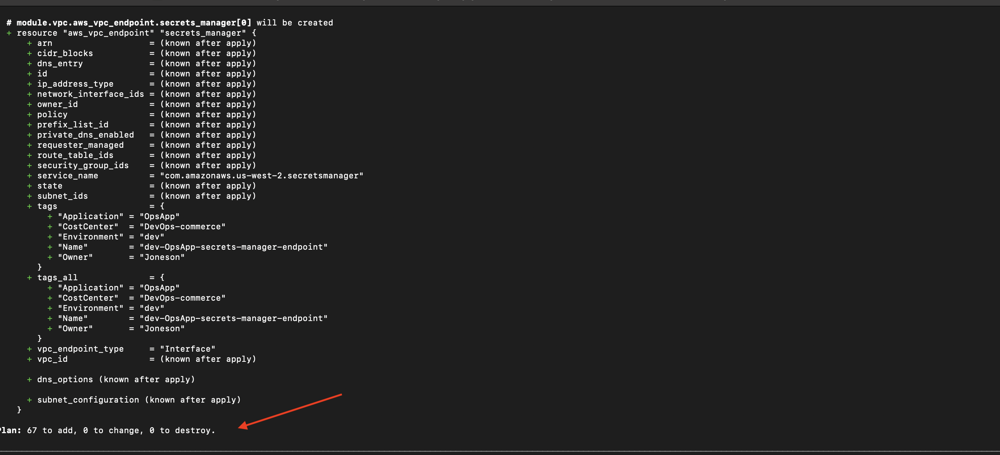

## Validate VPC

* Went to the AWS Console

* Clicked on the created VPC and navigated to view the Resource Map.

* 15 subnets , 6 route tables, internet gateway and NAT gateway were created as shown below;

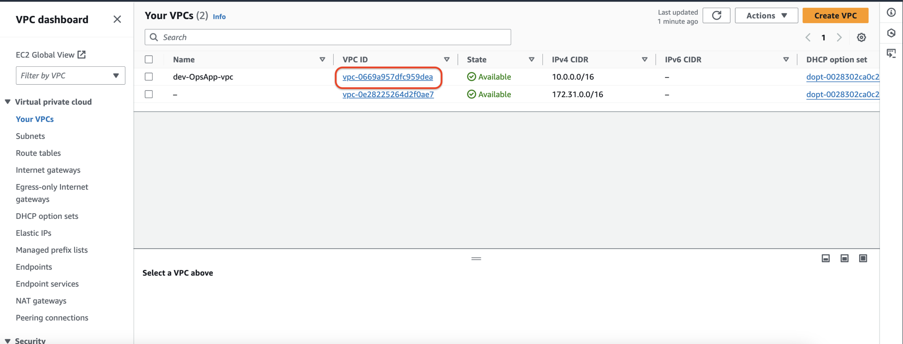

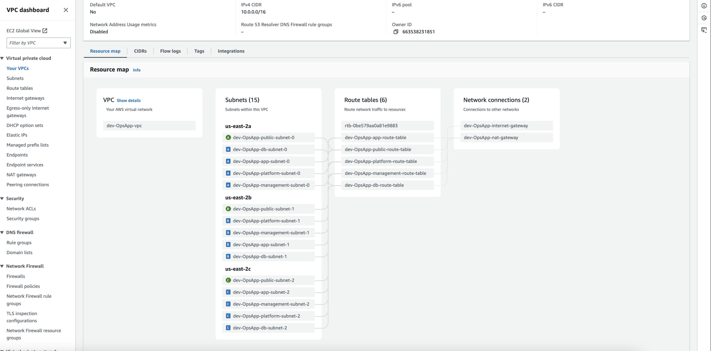

* Cleanedup the resources using the command below;

```
terraform destroy  -var-file=../../vars/dev/vpc.tfvars
```


